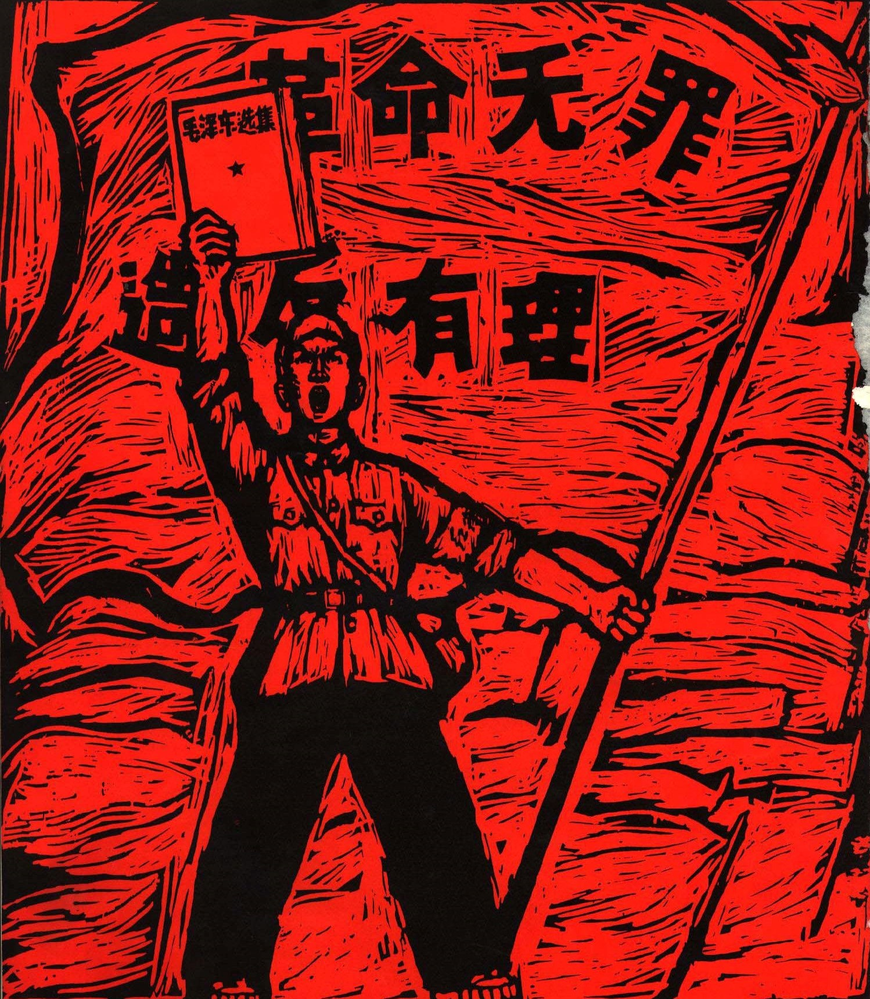
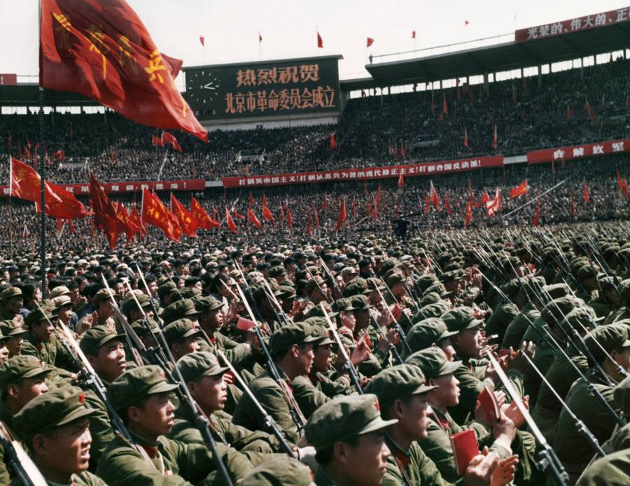

# Engineering Implementation Brief — index.html v4 Rewrite

**Target file:** `index.html` (currently 1493 lines, single-file HTML/CSS/JS)
**Authoritative spec:** `content-inventory-v4.md`
**This brief maps every v4 change to exact locations in the current code.**

---

## 0. GLOBAL RULES — apply everywhere

### G3: One-element-per-scroll principle
Every prose block, image, and interactive module must occupy its own near-full-viewport space. The reader must NEVER see the next section's content while reading the current element. Implementation: add generous `min-height` / `margin` / `padding` to every `.fade-in` block, every `.scrolly-step`, every image, every blockquote. A good baseline is `min-height: 80vh` for major elements or wrapping them in viewport-height containers.

### G4: Interactive module sizing
All interactive visualizations must fill 60–80% of viewport. Current code has many modules at `max-width: 680px` or smaller. Changes needed:

- `.weber-bars` (line 66): increase `height` from `300px` to `min(70vh, 500px)`, increase `max-width` to `800px`
- `.hemicycle-container` (line 164): increase `max-width` from `520px` to `min(60vw, 700px)`
- `.cr-timeline-viz` (line 174): increase `max-width` from `400px` to `min(50vw, 600px)`, increase year font-size
- `.branch-tree` (line 193): remove `max-width: 680px`, set to `width: 100%; max-width: 100vw`. Minimum height `70vh`
- `.polarization-viz` (line 144): increase `max-width` from `680px` to `min(80vw, 900px)`, `height` from `380px` to `min(70vh, 550px)`
- `.dissonance-demo` (line 125): increase `max-width` from `560px` to `min(70vw, 780px)`, increase padding
- `.inflate-number` (line 206): increase base `font-size` from `80px` to `min(15vw, 160px)`
- `#routineWrap .routine-diagram` (line 79): increase `max-width` from `760px` to `min(80vw, 900px)`
- `.referendum-bar` (line 250): increase `max-width` from `600px` to `min(70vw, 800px)`

### G5: AI writing purge
All prose in the HTML must be rewritten to remove AI sentence patterns. Rules:
- Eliminate "Not X, but Y" / "Both X and Y" balanced structures → flatten into direct claims
- Remove inflated adjectives: comprehensive, robust, seamless, nuanced, transformative, dynamic, holistic
- Kill filler transitions: "It's worth noting", "Importantly", "In conclusion"
- Kill fake-depth patterns: "A is not B, but A is a C that does D"
- Short declarative sentences. Abrupt endings OK. Asymmetry fine. Opinions fine.
- Match original language. Delete hollow sentences. Do NOT add new content.

Apply this to EVERY paragraph in the document. The spec (v4) already contains the corrected prose for most elements — use the spec text verbatim where provided.

### Filename updates (apply throughout)
Replace all OLD filenames with corrected versions:
- `s2-lenin-origianl.jpg` → `s2-lenin-original.jpg` (line 528)
- `s2-lenin_removed.jpg` → `s2-lenin-removed.jpg` (line 529)
- `s2_stalin_original.jpg` → `s2-stalin-original.jpg` (line 538)
- `s2_stalin_removed.jpg` → `s2-stalin-removed.jpg` (line 539)
- `s2-muhammud.jpg` → `s2-muhammad.jpg` (line 556)
- `s2-abura.jpeg` → `s2-ashura.jpeg` (line 562)
- `s2-karbala.webp` → `s2-karbala-battle.jpg` (line 559)
- `s1-charismatic-leadership.jpg` → `s1-nuremberg-rally-1934.jpg` (line 381)

---

## 1. HERO SECTION — Major restructure (lines 362–374)

### Current structure:
```
#hero {
  hero-bg (JFK debate image)
  content-wrap {
    hero-quote (Herbert quote)
    hero-title
    hero-body (3 paragraphs)
  }
  hero-herbert (small portrait, top-right, 100×132px)
}
```

### v4 target: Three-phase scroll sequence

**Phase 1 — The Warning (full viewport, centered)**
- Herbert portrait (`opening-frankherbert.jpg`) — **centered, large** (~40% viewport width). NOT small top-right.
- Herbert quote centered below portrait.
- This phase alone fills one full viewport. Nothing else visible.

**Phase 2 — Title reveal**
- `The Dark Side of Charismatic Leadership` fades in on scroll. Centered or left-aligned.

**Phase 3 — Context**
- JFK debate image fades in as background (15% opacity, grayscale)
- Body paragraph 1 (TV debate)
- Body paragraph 2 (Frank Herbert / Paul Atreides)
- **NEW: Paul Atreides image** (`opening-paul-atreides.png`) after paragraph 2. Alt: "Paul Atreides." Caption: "The hero Herbert tried to warn you about."
- Body paragraph 3 (what this website is about)
- Each element occupies its own scroll step per G3.

### Implementation:
1. Delete current `.hero-herbert` positioning (line 55–56, 330: `position:absolute;right:40px;top:120px;width:100px`). Replace with centered block layout, `width: min(40vw, 400px)`, `margin: 0 auto`.
2. Restructure `#hero` HTML: create three wrapper divs (`.hero-phase-1`, `.hero-phase-2`, `.hero-phase-3`), each `min-height: 100vh`.
3. Phase 1: Herbert portrait centered + quote below. Both fade-in via GSAP ScrollTrigger.
4. Phase 2: Title only, centered, fade-in.
5. Phase 3: JFK bg fades in, paragraphs reveal one by one. After the Paul Atreides paragraph, insert: `<div class="section-image fade-in"><div class="caption">The hero Herbert tried to warn you about.</div></div>`
6. Update JS (lines 954–961) to match new structure — the current `heroTL` timeline references `.hero-quote`, `.hero-title`, `.hero-herbert` which will all change.

---

## 2. SECTION 1 — When Charisma Meets Power (lines 377–491)

### 2a. Header image replacement (line 381)
**Current:** `s1-charismatic-leadership.jpg` (comic-style superhero)
**Change to:** `s1-nuremberg-rally-1934.jpg`
Update the `<p>Weber's three types of authority are not equal in practice. When charisma enters the room, the other two buckle.</p></div>
```

### 2d. Mao "bombard the headquarters" quote — MOVE (lines 487–488 → line 473)
**Current location:** Step 4 of CR scrolly (line 487), at the END of the Cultural Revolution narrative.
**Move to:** Step 0 (after the "Bombard the Headquarters" poster description, ~line 473). The quote is the catalyst, not the epilogue.

Remove from Step 4:
```html
<blockquote>"To rebel is justified — bombard the headquarters!"<cite>— Mao Zedong, 1966</cite></blockquote>
```

Insert into Step 0, after the second paragraph about Mao writing the poster:
```html
<blockquote>"To rebel is justified — bombard the headquarters!"<cite>— Mao Zedong, 1966</cite></blockquote>
```

Also in Step 4, remove the pattern-repeating paragraph that starts "Hitler got the institutions..." — or keep it but ensure it doesn't reference the quote that's been moved.

### 2e. Two Cultural Revolution images added
**Step 1** (line 476, after "The loyalty is absolute."): Insert:
```html
<div class="section-image"><div class="caption">1967. "Revolution is innocent, rebellion is justified."</div></div>
```

**Step 3** (line 483, after "The weapon he built no longer answers to him."): Insert:
```html
<div class="section-image"><div class="caption">The PLA takes control. The revolution Mao started now requires an army to contain.</div></div>
```

---

## 3. SECTION 2 — The Movement Outlives the Leader (lines 494–650)

### 3a. Photo retouching context paragraph (insert before line 526)
Before the first before/after slider, after `p.ba-erasure-intro`, add a NEW paragraph explaining Soviet retouching techniques:
```html
<div class="fade-in"><p>These alterations were not digital. Soviet retouchers used airbrushes, ink, and darkroom compositing to paint people out of negatives and prints by hand. The process could take days. The results were distributed as official history — the doctored versions replaced the originals in archives, newspapers, and textbooks. What you see below is not a Photoshop exercise. It is what the state actually did.</p></div>
```

### 3b. Photo slider alignment (lines 526–545)
Both BA sliders must crop/mask images to identical aspect ratios. In CSS for `.ba-slider .ba-wrap` (line 97), enforce a fixed `aspect-ratio: 4/3` (or whichever matches best) and `object-fit: cover` on both images. Currently `aspect-ratio:16/10` — check if both image pairs match at this ratio. If not, adjust.

### 3c. Purge counter → scroll-driven (lines 546, 1236–1244)
**Current:** `animateCounter(document.getElementById('purgeExec'),750000,2.5)` — triggers once on scroll-into-view.
**Change to:** Wrap the purge stats in a scroll-driven container (~150vh). Use GSAP ScrollTrigger with `scrub` to incrementally count from 0 to final values as user scrolls. Similar pattern to the year counter (lines 1027–1057).

### 3d. Delete Lenin's Testament closing quote (line 551)
**Current:** `<blockquote class="fade-in">"Stalin is too rude... I propose to find a way to remove Stalin from that position..."` — this is redundant with the testament interactive (lines 506–521).
**DELETE this entire blockquote element.**

### 3e. Muhammad image caption fix (line 556)
**Current:** `alt="The early Islamic world"` / `caption: "The early Islamic world"`
**Change to:** `alt="Conceptual artistic portrait of the Prophet Muhammad"` / caption: `"A conceptual portrait. In Islamic tradition, figurative depictions of the Prophet vary by era and region."`

### 3f. Karbala image replacement (line 559)
**Current:** `src="assets/s2-karbala.webp"`
**Change to:** `src="assets/s2-karbala-battle.jpg"` with `alt="The Battle of Karbala, 680 CE — oil painting depicting the close-combat massacre of Husayn's forces"`

### 3g. Islamic tree enlarged (lines 193–202, 565)
In CSS `.branch-tree` (line 193): remove `max-width:680px`, replace with `width:100%; max-width:none; min-height:70vh`.
The SVG viewBox is currently `0 0 760 560` — consider increasing or letting the container scale it up.

### 3h. Death counter (632→2026) — add event labels (lines 641–649, JS 1027–1057)
**Current:** Shows only year + cumulative toll number.
**v4 enhancement:** As the counter reaches each conflict threshold, fade in an event label identifying the specific conflict and its individual toll. Labels:
- Year ~680: `Karbala & early succession wars — ~10,000`
- Year ~750: `Umayyad civil wars — ~70,000`
- Year ~1988: `Iran-Iraq War (1980–88) — ~1,000,000`
- Year ~2011: `Iraq Civil War (2003–11) — ~200,000`
- Year ~2014: `Syrian Civil War (2011–) — ~500,000`
- Year ~2026: `Yemen Civil War (2014–) — ~150,000+`

Add a `<div class="yc-event-label" id="ycEvent"></div>` inside `.yc-viz`. In JS, update the `onUpdate` callback to show/fade labels at the appropriate year thresholds.

---

## 4. SECTION 3 — Followers Are Self-Sealing (lines 652–746)

### 4a. Peng Dehuai restructured into 5-step scroll sequence (lines 659–665)
**Current:** Two images side-by-side (`.image-pair`) + one paragraph of text, all in a single block.
**v4 target:** Five discrete scroll steps, each occupying its own viewport:

**Step 1:** Peng Dehuai military portrait (`s1-peng-dehuai-military-portrait.jpg`), full viewport, centered. Caption: "Peng Dehuai — defense minister, war hero, veteran of Korea."

**Step 2:** Paragraph only: "Not everyone lied. In July 1959, Marshal Peng Dehuai — China's defense minister and one of the most decorated commanders of the Korean War — wrote a private letter to Mao at the Lushan Conference. He called the backyard steel campaign 'a waste of resources and manpower.' He said the harvest numbers were inflated. He was right about everything."

**Step 3:** Paragraph + NEW image: "Mao read the letter aloud to the Politburo — not to act on it, but to force everyone in the room to choose a side." + Image: `s3-mao-lushan-conference-1959.jpeg` (alt: "Mao Zedong at the Lushan Conference, 1959"; caption: "Lushan, July 1959. Mao turns Peng's letter into a loyalty test.")

**Step 4:** Peng struggle session image (`s1-peng-dehuai-struggle-session.jpg`) + paragraph: "Peng was stripped of all positions, placed under house arrest, and eventually handed to the Red Guards." Caption: "The same man, after. Beaten until his back was broken. Died in prison, 1974."

**Step 5:** Paragraph only: "The message was clear: the system does not lack information. It punishes the people who carry it. Every official in the chain below Peng understood what his fate meant for theirs."

Implementation: Replace lines 659–665 with a scrolly-style structure (can reuse `.scrolly-centered` pattern or create a new `.peng-scroll` wrapper with sticky/step layout). Each step gets `min-height: 100vh`.

### 4b. Inflate scrolly Step 5 — add famine causal explanation (line 682)
**Current Step 5 text:** `"**The number collapses into reality.** There is no surplus. There is famine."`
**v4 replacement:** `"**The number collapses into reality.** Beijing believed the inflated harvest reports. Grain was exported to repay Soviet debts and fund industrialization. Local food reserves were seized for redistribution to cities. No one sent food back — because the numbers said there was more than enough. There was famine not because the crops failed, but because the system acted on lies as if they were true."`

### 4c. Cognitive dissonance demo expanded (lines 698–710)
**Current:** Three `.dd-step` lines + two buttons + one result.
**v4 target:** Multi-step reveal with more context:

1. Scene-setting: "You are a county official in Henan province, 1959. You have just inspected the fields yourself."
2. Fact: "The harvest was **100 tons.**"
3. Claim (red): "The Party says the harvest was **1,000 tons.**"
4. Context: "The last official who reported real numbers was sent to a labor camp. His family does not know where he is."
5. Prompt: "WHAT DO YOU REPORT?"
6. Buttons: "Report 100 tons (the truth)" / "Report 1,000 tons (the Party line)"
7. Results differ by choice:
   - Truth: "You have chosen what Peng Dehuai chose. He was stripped of his rank, beaten, and died in prison."
   - Party line: "You have chosen what every official in the chain chose. The grain was exported. Your village starved."
8. Final (both): "In 1959, every official chose the Party line. Not because they believed it — but because the cost of honesty was higher than the cost of famine."

Replace the HTML at lines 698–710 and update the JS at lines 1000–1018 to handle the new two-outcome logic.

### 4d. Polarization module clarified (lines 712–726)
**Before the visualization** (after line 713), add intro paragraph:
```html
<div class="fade-in"><p>The simulation below shows how this works. Each dot is a person. Watch what happens when they find others who agree with them — and what happens when the algorithm decides what they see.</p></div>
```

**Update phase labels** in JS (lines 1361, 1370, 1379):
- Phase 1: "Individual beliefs — scattered. Each person holds their own position."
- Phase 2: "Group polarization — people find others who agree. The center empties. Moderates are pulled to the nearest cluster or go silent."
- Phase 3: "Filter bubbles — the algorithm shows you what keeps you engaged. You stop seeing the other side. Not because it disappeared, but because the feed decided it wasn't relevant."

---

## 5. TAKEAWAY — Shorten and make interactive (lines 753–856)

### 5a. Shorten prose
**Current line 757** has a massive paragraph block. Cut to:
- "If you have read this far, you might be thinking: we need better leaders." / "That thought is the trap."
- Remove the long "It is the same logic that dismantled the Weimar Republic..." buildup.

**Current line 758** (founders blockquote): Shorten to: "The founders of the American republic did not design for angels. They designed for men who would inevitably become corrupt, cowardly, or deluded — and they tried to build a system that could survive them anyway."

**Current line 759:** Replace "Madison and his contemporaries built what they called 'auxiliary precautions' — structures..." with just: "Madison called them 'auxiliary precautions':"

**Principles (lines 760–762):** Shorten:
- P1: "**Separation of powers.** No single person holds enough authority to act alone."
- P2: "**Term limits and succession rules.** Written in advance, enforced without exception. The leader leaves. The system stays."
- P3: "**Independent press and judiciary.** Their job is to say no."

**Current line 763** (massive synthesis paragraph): Cut to: "Nobody rallies for judicial independence. You cannot build a mass movement around the separation of powers. These things are boring. That is why they work." / "But do they? Everything above is a story of cages that failed. Three times in the twentieth century, the cages held."

### 5b. Counter-example paragraphs — shorten
**De Gaulle (lines 770–786):** Tighten paragraphs to 2–3 sentences max per the v4 spec text.
**FDR (lines 792–795):** Already fairly tight. Keep.
**Mandela (lines 800–802):** Tighten per v4 spec.

### 5c. Synthesis paragraphs (line 828)
Replace the current long block with:
"Weber's third path — charisma constrained by institutions — held three times. But Mandela's case is the fragile one. His restraint came from character, not from design." / "The cages do not hold by themselves. They hold because someone decides they matter more than the leader standing in front of them."

---

## 6. FILENAME UPDATES — Comprehensive list

Search-and-replace in HTML (apply all):

| Old (in current HTML) | New | Line(s) |
|---|---|---|
| `s2-lenin-origianl.jpg` | `s2-lenin-original.jpg` | 528 |
| `s2-lenin_removed.jpg` | `s2-lenin-removed.jpg` | 529 |
| `s2_stalin_original.jpg` | `s2-stalin-original.jpg` | 538 |
| `s2_stalin_removed.jpg` | `s2-stalin-removed.jpg` | 539 |
| `s2-muhammud.jpg` | `s2-muhammad.jpg` | 556 |
| `s2-abura.jpeg` | `s2-ashura.jpeg` | 562 |
| `s2-karbala.webp` | `s2-karbala-battle.jpg` | 559 |
| `s1-charismatic-leadership.jpg` | `s1-nuremberg-rally-1934.jpg` | 381 |

---

## 7. CSS CHANGES SUMMARY

All in the `<style>` block (lines 10–339):

1. **`.hero-herbert`** (line 55): Delete absolute positioning. Restructure for centered large portrait.
2. **`.weber-bars`** (line 66): `height: min(70vh, 500px); max-width: 800px`
3. **`.hemicycle-container`** (line 164): `max-width: min(60vw, 700px)`
4. **`.cr-timeline-viz`** (line 174): `max-width: min(50vw, 600px)`
5. **`.branch-tree`** (line 193): `max-width: none; width: 100%; min-height: 70vh`
6. **`.polarization-viz`** (line 144): `max-width: min(80vw, 900px); height: min(70vh, 550px)`
7. **`.dissonance-demo`** (line 125): `max-width: min(70vw, 780px)`
8. **`.inflate-number`** (line 206): `font-size: min(15vw, 160px)`
9. **`.routine-diagram`** (line 79): `max-width: min(80vw, 900px)`
10. **`.referendum-bar`** (line 250): `max-width: min(70vw, 800px)`
11. **New CSS for Peng Dehuai scroll sequence** — create `.peng-scroll` wrapper with sticky/step pattern.
12. **New CSS for scroll-driven purge counter** — add a tall scroll container.
13. **G3 spacing**: Add `margin-bottom: max(20vh, 120px)` to all `.fade-in` elements inside prose sections, or use explicit viewport-height spacers between elements.

---

## 8. JAVASCRIPT CHANGES SUMMARY

All in the `<script>` block (lines 931–1491):

1. **Hero animation** (lines 954–961): Rewrite `heroTL` to match three-phase scroll structure.
2. **Purge counter** (lines 1236–1244): Convert from `animateCounter` (one-shot) to `ScrollTrigger` scrub-driven animation with a 150vh tall scroll container.
3. **Year counter event labels** (lines 1027–1057): Add event label logic to `onUpdate` callback — show/hide labels at year thresholds.
4. **Dissonance demo** (lines 1000–1018): Rewrite to handle two different outcomes based on button choice, with expanded step-by-step reveal.
5. **Polarization labels** (lines 1361, 1370, 1379): Update label strings to longer, more descriptive versions.
6. **Peng Dehuai scroll sequence**: Add new ScrollTrigger instance for the 5-step scroll.

---

## 9. EXECUTION ORDER

Recommended order for implementation:

1. **Filename replacements** (mechanical find-replace, zero risk)
2. **CSS global sizing changes** (G4 module enlargement)
3. **CSS G3 spacing** (viewport-height gaps between elements)
4. **Hero restructure** (HTML + CSS + JS)
5. **S1 changes** (header image, Weber portrait, quote move, CR images)
6. **S2 changes** (retouching context, slider alignment, filenames, Muhammad caption, Karbala image, tree enlargement, death counter labels)
7. **S3 changes** (Peng Dehuai scroll, inflate step 5, dissonance demo, polarization labels)
8. **Takeaway shortening** (prose cuts)
9. **Delete redundant Lenin testament quote**
10. **AI writing purge** (final pass on ALL prose)
11. **Test scroll behavior** — verify G3 compliance: at every scroll position, only one element should be visible. No content from the next section leaks in.

---

## 10. TESTING CHECKLIST

After all changes:
- [ ] All 8 renamed image files load correctly (no 404s)
- [ ] `opening-paul-atreides.png` appears after the Dune paragraph
- [ ] `s1-nuremberg-rally-1934.jpg` replaces the old superhero image
- [ ] `s1-cr-rebellion-poster-1967.jpg` appears in CR Step 1
- [ ] `s1-cr-pla-revolutionary-committee.jpg` appears in CR Step 3
- [ ] `s3-mao-lushan-conference-1959.jpeg` appears in Peng Step 3
- [ ] `s2-karbala-battle.jpg` replaces the old blurry webp
- [ ] Herbert portrait is centered and large in Hero Phase 1
- [ ] Paul Atreides image appears after the Dune paragraph
- [ ] Mao quote is in CR Step 0, not Step 4
- [ ] Lenin's Testament closing blockquote is deleted
- [ ] Muhammad image caption says "conceptual portrait", not "early Islamic world"
- [ ] All interactive modules fill 60–80% viewport
- [ ] Peng Dehuai section has 5 discrete scroll steps
- [ ] Inflate Step 5 explains the famine mechanism
- [ ] Dissonance demo has two different outcomes
- [ ] Year counter shows event labels at thresholds
- [ ] Purge counter is scroll-driven (not snap-trigger)
- [ ] Islamic tree fills full viewport width
- [ ] Polarization phase labels are expanded
- [ ] Takeaway paragraphs are shortened
- [ ] Photo sliders have matched aspect ratios + context paragraph
- [ ] No AI-flavored writing remains
- [ ] G3: at every scroll position, only one element visible
- [ ] No-JS fallback still works
- [ ] Progress nav dots still track sections correctly
